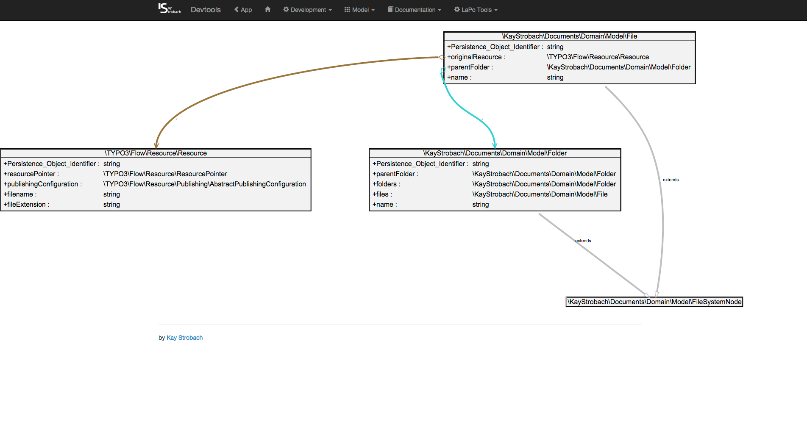
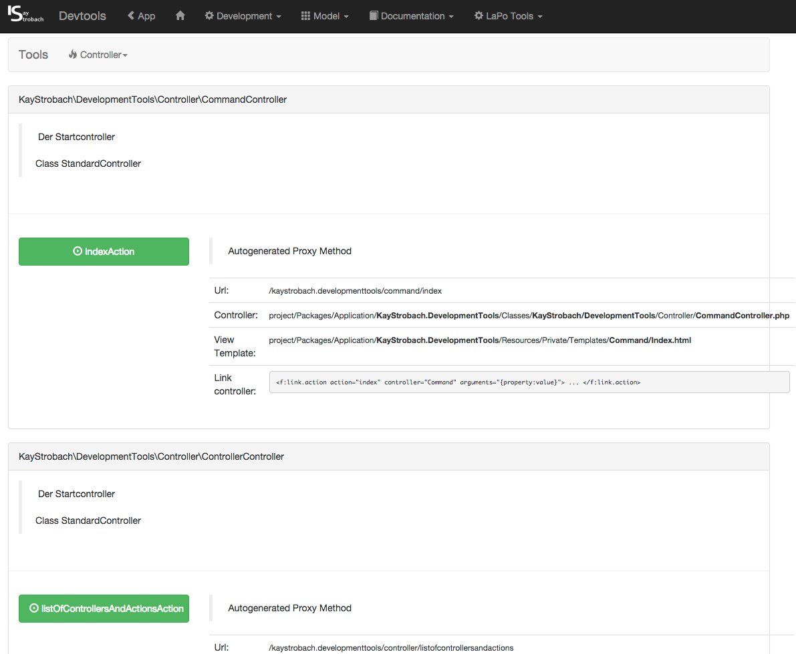
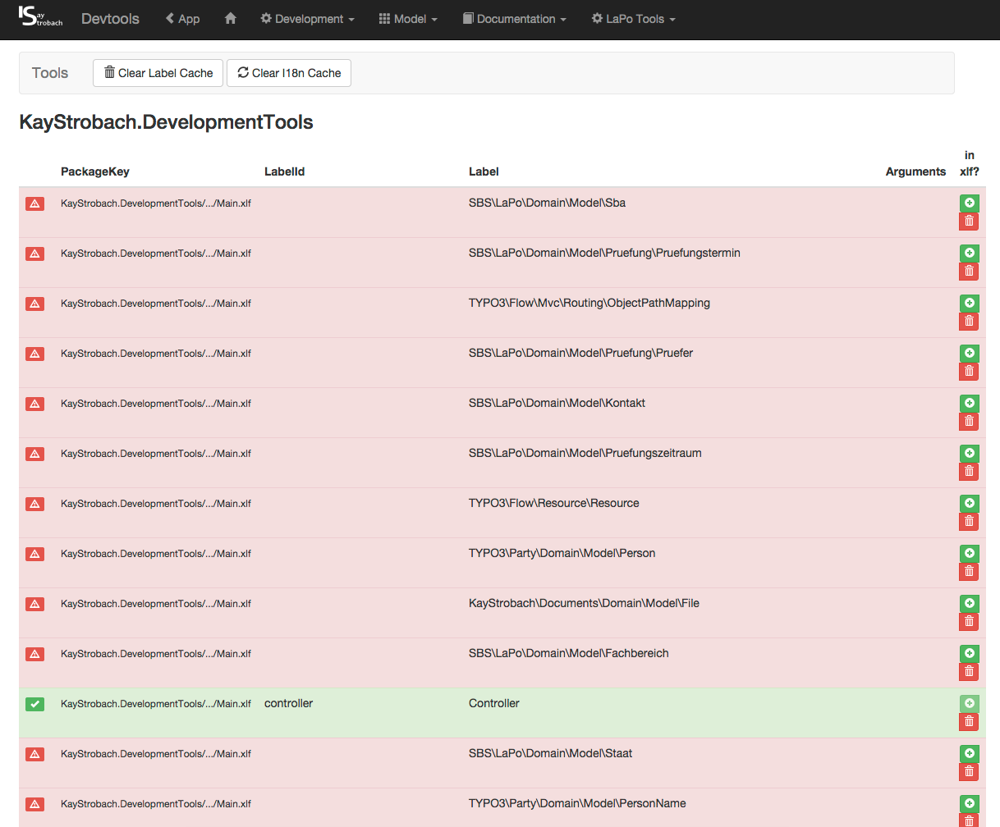
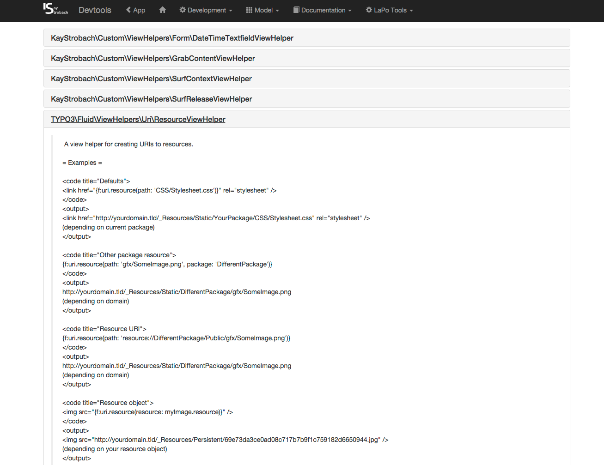

FLOW/Developmenttools
=======================

GUI tool to show some information about your project.

The GUI is called via http://baseuri/kaystrobach.developmenttools/standard/index

Currently the following functionality is given:

* UML view of the model, which is generated from the real classes and can be filtered, panned, zoomed
* List Cli Commands (inkl. Params) 
* List Controllers and actions inkl. Params, which are linked if no params are needed
* List of ViewHelpers including Documentation from Reflection
 * maybe expanded with parameters from reflection in the near future
* Show translations in system, including missing with option to extend the xml easily

Impressions
===========

